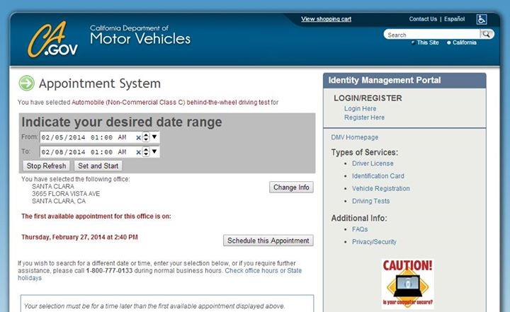

# DMV appointment booking script
[This script](script.js) is here to help you schedule appointments via DMV's site, specifically [https://www.dmv.ca.gov/wasapp/foa/findDriveTest.do](https://www.dmv.ca.gov/wasapp/foa/findDriveTest.do).

**Please Note: This is not a hack, all it does is automate an otherwise tedious process of page refreshing and manual monitoring.**

Please read section on [What the script does](README.md#what-the-script-does) for more information.

## Requirements
* Please install a user **script manager** for your browser, e.g. Tampermonkey for Chrome (under chrome apps)
  * A user script manager is what allows you to run custom scripts on top of a given webpage
  * This script is written for Tampermonkey so if you're using any other script managers, you might need to make some slight edits to the code
  * After script manager is installed, just load the code and turn it on for the page it is intended to be used on
* Please also ensure that **cookies** are enabled in your browser. 

## What the script does
It inserts a grey area on the page (see screenshot below) that allows you to specify a date range that you would like your appointment to be.
It'll then continuously refresh the page until an appointment within that date range is detected and your browser will alert you via a dialog.

## How to use
Load the script, go to the page, indicate date range, hit "Set and Start" to initiate the refreshing process. If you would like to pause the process anytime to change the date range, just hit "Stop Refresh". To resume, hit "Set and Start" again. When you're all set, leave the page open in its tab and it'll take care of the job.

*For now the code is intended for use with Tampermonkey on DMV's "Behind the wheel driving test" appointment booking page. However with a few tweaks in the header of the code, you could virtually use it for any type of appointments on DMV.*

**Cheers and happy booking!**
